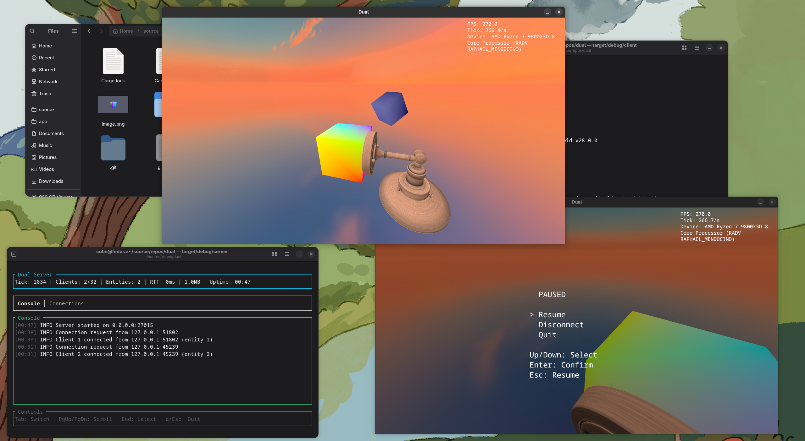
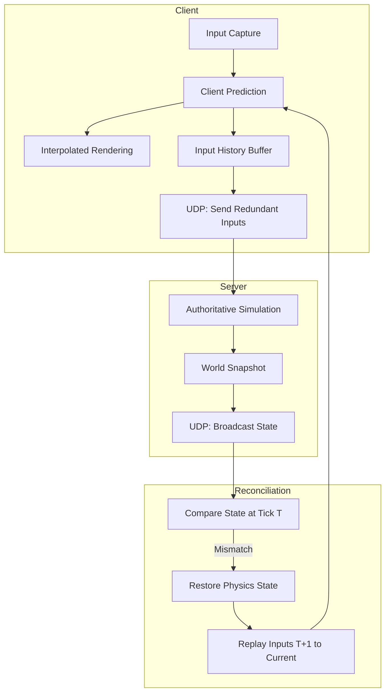

# Dual




Dual is a high-performance, server-authoritative multiplayer FPS engine written in Rust. **Note: This project is currently a proof of concept**, engineered for low-latency competitive gameplay, utilizing custom networking protocols and a deterministic simulation architecture inspired by industry standards (Quake, Source).

## Project Ambition

The goal of Dual is to provide a modern, boilerplate-free foundation for fast-paced multiplayer games. It prioritizes:
- **Networking Fidelity**: Robust handling of jitter, packet loss, and high latency through redundancy and advanced reconciliation.
- **Performance**: Zero-copy serialization, minimal allocations in hot paths, and efficient multi-threaded execution.
- **Architectural Clarity**: A clear separation between simulation logic, rendering, and network synchronization.

## Technical Architecture

### Threading & Execution Model

Dual employs a multi-threaded architecture to decouple simulation from rendering and network I/O:

- **Main Thread**: Manages the `winit` event loop, processes raw input, and handles `wgpu` rendering commands. It performs entity interpolation to provide smooth visuals between discrete simulation steps.
- **Simulation Thread**: Executes game logic at a fixed frequency (default 60Hz). It handles physics integration (Rapier 3D), client-side prediction, and state reconciliation.
- **Network Task**: An asynchronous `tokio` task managing UDP sockets. It handles `rkyv`-based serialization/deserialization and manages the reliability layer.

### State Synchronization

The engine uses a server-authoritative model with sophisticated client-side techniques:



### Networking Protocol

Dual implements a custom protocol over UDP:
- **Reliability Layer**: Uses sequence numbers and bitmask-based acknowledgments (similar to Quake/GafferOnGames).
- **Input Redundancy**: Every client packet includes the last $N$ inputs to mitigate the impact of packet loss without requiring retransmissions.
- **Zero-Copy Serialization**: Utilizes `rkyv` to map network buffers directly into memory-mapped structures, bypassing traditional deserialization overhead.

## Implementation Details

### Simulation Loop
The simulation uses a fixed-timestep accumulator. This ensures that game logic—especially physics—remains deterministic across different hardware and frame rates. The accumulator pattern prevents "spiral of death" scenarios by clamping the maximum number of steps performed per frame.

### Rendering & Interpolation
While the simulation runs at a fixed rate, rendering is decoupled. Remote entities are interpolated between the two most recent snapshots received from the server. This introduces a small "interpolation delay" (typically 100ms) but results in perfectly smooth movement even with network jitter.

### Physics & Determinism
The engine integrates `Rapier 3D` for collision detection and rigid body dynamics. The physics state is snapshotable, allowing the simulation thread to "rewind" the world to a specific tick, re-run the simulation with corrected inputs, and "fast-forward" back to the current time—a process essential for transparent lag compensation and client-side reconciliation.

## Detailed System Breakdown

The Dual engine is partitioned into three primary crates: `client`, `server`, and a shared `game` library. This separation ensures strict boundary enforcement and facilitates headless server deployments.

### 1. Shared Logic (`crates/game`)
This crate contains the "Source of Truth" for the engine's simulation and protocol.
- **Protocol Definition**: Defines the binary format for snapshots and inputs using `rkyv`. It includes optimized bitsets for packet acknowledgment and delta-compression-ready state structures.
- **Network State**: Houses the `WorldSnapshot` and `EntityState` types. These are designed to be tightly packed for minimal MTU footprint.
- **Lobby Management**: Handles the transition from connection to active simulation, including player identity and initial state synchronization.

### 2. Client Architecture (`crates/client`)
The client is a hybrid of a real-time renderer and a predictive simulator.
- **`render/` Module**: Built on `wgpu`, it implements a forward-plus rendering pipeline. It handles GLTF model loading, PBR material evaluation, and a specialized skybox renderer. The `camera` system uses a decoupled transform to allow for screen-shake and recoil without affecting the underlying physics orientation.
- **`net/` Module**: Manages the life-cycle of a UDP connection. It implements an `InterpolationBuffer` that stores approximately 100-200ms of server state, performing SLERP (Spherical Linear Interpolation) for rotations and LERP for positions of remote entities.
- **`game/` Module**: The local simulation runner. It captures raw HID input via `winit` and feeds it into the `PredictionEngine`, which computes the local player's position ahead of server confirmation.

### 3. Server Architecture (`crates/server`)
The server is designed for high-tickrate performance and low-overhead simulation.
- **Authoritative Simulation**: The `simulation.rs` module executes the master game loop. It processes incoming input buffers, resolves collisions via Rapier, and prepares the next world snapshot.
- **Input Buffering**: To account for network jitter, the server maintains a small "jitter buffer" of client inputs. It attempts to execute inputs at the specific server tick they were intended for, falling back to extrapolation if a packet is delayed.
- **TUI Management**: Integrated `ratatui` interface for real-time monitoring of server health, connected peers, and network throughput without the overhead of a graphical window.

### 4. Networking Deep-Dive
Dual uses a "State Synchronization" model rather than "Input Streaming." 
- **Snapshot Broadcasting**: The server broadcasts the entire world state (or a filtered PVS - Potentially Visible Set) at regular intervals. 
- **Input Redundancy**: Because UDP is unreliable, the client sends `Input[T, T-1, T-2, T-3]` in every packet. This ensures that even if 75% of packets are lost, the server can still reconstruct a continuous input stream.
- **Lag Compensation**: The server maintains a 200ms history of the world. When a client reports a "shot" at tick $T$, the server temporarily reverts its physics colliders to their positions at $T$ to validate the hit, effectively eliminating the need for players to "lead" their targets based on ping.

## Technical Stack

| Layer | Technology |
|-------|------------|
| **Language** | Rust 2024 Edition |
| **Graphics** | `wgpu` (WebGPU) |
| **Windowing** | `winit` |
| **Math** | `glam` |
| **Async** | `tokio` |
| **Serialization**| `rkyv` (Zero-copy) |
| **Physics** | `Rapier 3D` |
| **UI** | `ratatui` (Debug/Server TUI) |

## Project Status

**Current Phase**: 1 (Core Integration) | **Status**: Proof of Concept / Experimental
- [x] Custom `wgpu` renderer with GLTF and skybox support.
- [x] Async UDP networking with reliability layer.
- [x] Fixed-timestep simulation loop.
- [x] Entity interpolation system.
- [ ] Full client-side prediction (In Progress).
- [ ] Rapier 3D physics integration (Planned).

## Controls

| Key | Action |
|-----|--------|
| `W` `A` `S` `D` | Movement |
| `Space` / `Ctrl`| Fly Up / Down |
| `Shift` | Sprint |
| `Esc` | Release Mouse |
| `F11` | Toggle Fullscreen |
| `Shift + F12` | Quit |

## Getting Started

### Prerequisites
- Rust 1.80+ (Nightly recommended for some optimizations)
- Vulkan/Metal/DirectX compatible GPU

### Build & Run

```bash
# Start Client
cargo run -p client --release

# Start Server
cargo run -p server --release
```

## License

All Rights Reserved.
