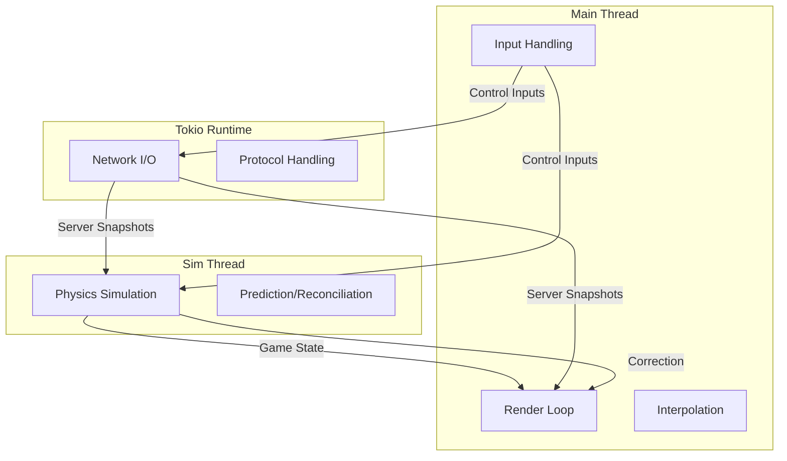

# Multiplayer FPS Architecture Analysis

This report outlines the optimal architecture for a server-authoritative multiplayer FPS using Rust, specifically tailoring to the provided constraints (minimal third-party dependencies, specific libraries like `wgpu`, `winit`, `tokio`).

## 1. Threading Architecture

To achieve a responsive UI/Renderer while maintaining deterministic physics and reliable networking, a **Triple-Loop Architecture** is recommended.

### Not all loops are threads
While we conceptually have three loops, they map to threads differently:
1.  **Main Thread (Render Loop)**: Must own `winit` window handling and `wgpu` surface presentation.
2.  **Simulation Thread (Fixed Loop)**: A dedicated `std::thread` that runs the physics tick at a fixed rate (e.g., 60Hz).
3.  **Network Task (Async Loop)**: A `tokio` background task that handles I/O.



### Why this split?
*   **Non-blocking**: The render loop never waits for a physics tick or a network packet.
*   **Stability**: If the specific frame takes too long to render, it doesn't slow down the network keep-alives or the physics prediction ticks.
*   **Pacing**: Physics requires precise timing (e.g. exactly 16.6ms). `winit`'s event loop is driven by the OS and monitor refresh rate, which is variable.

---

## 2. World State Management

Handling state in a fast-paced shooter requires differentiating between **Standard State**, **Render State**, and **Event State**.

### Struct Structures

```rust
// The "Truth" for a specific tick
#[derive(Clone, Debug, Serialize, Deserialize)]
pub struct WorldSnapshot {
    pub tick: u64,
    pub players: Vec<PlayerState>,
    pub projectiles: Vec<ProjectileState>,
}

// Minimal data needed for interpolation
#[derive(Clone, Debug)]
pub struct RenderState {
    pub position: glam::Vec3,
    pub rotation: glam::Quat,
    // Other visual-only properties (animation state, etc.)
}

// One-off events (Sound, Particles, Kill logs)
#[derive(Clone, Debug, Serialize, Deserialize)]
pub enum GameEvent {
    PlayerSpawned(u32),
    WeaponFired { from: u32, kind: WeaponType },
    Explosion { at: glam::Vec3 },
}
```

### Handling Interpolation & Buffering
The Render Thread should maintain a **Snapshot Buffer**.

1.  **Buffer**: Store the last ~20 snapshots received from the server (or generated by local prediction).
2.  **Render Time**: `render_time = current_real_time - interpolation_delay` (usually 100ms).
3.  **Algorithm**:
    *   Find Snapshot A where `A.timestamp <= render_time`.
    *   Find Snapshot B where `B.timestamp > render_time`.
    *   `fraction = (render_time - A.timestamp) / (B.timestamp - A.timestamp)`.
    *   `entity.position = A.position.lerp(B.position, fraction)`.

### Handling Lifetimes & Events
Do **not** store events in the snapshot state. Events should be a separate queue attached to a tick.

*   **Snapshots**: "State of the world at tick T". (Persistent)
*   **Events**: "What happened during the transition to tick T". (Transient)

This allows the renderer to play a sound *once* when it processes tick T, even if it renders tick T multiple times.

---

## 3. Loop Communication

Communication must be non-blocking. We use **Channels** (`tokio::sync::mpsc` or `std::sync::mpsc`) for events and **Triple Buffering** or **RwLock** for state.

### Recommended Communication Matrix

| Source | Destination | DataType | Mechanism | Reason |
| :--- | :--- | :--- | :--- | :--- |
| **Main** | **Sim** | `Input` | `mpsc::channel` | Inputs must be processed in order. |
| **Sim** | **Main** | `State` | `crossbeam` / `RwLock<Arc<State>>` | The renderer just needs the *latest* reliable state for prediction visualization. |
| **Net** | **Sim** | `packet` | `mpsc::channel` | Sim needs to process packets in the game loop context. |
| **Sim** | **Net** | `packet` | `mpsc::channel` | Sim sends commands/inputs to be serialized and sent. |

### Minimal Blocking Strategy
Avoid `Mutex` in the hot loops.
*   **Simulation Thread**: Produces a `Arc<WorldState>`.
*   **Render Thread**: Has a `RwLock<Arc<WorldState>>`.
*   **The Swap**: At the end of a Sim tick, Sim acquires write lock (very briefly) to swap the Arc, or sends the Arc over a channel. A channel is preferred to avoid *any* locking.

```rust
// Sim Thread
let new_state = Arc::new(run_physics(&old_state, &inputs));
state_sender.send(new_state.clone()).unwrap(); // Non-blocking send

// Render Thread
// Consume all available states to get the latest one
while let Ok(state) = state_receiver.try_recv() {
    latest_state = state;
}
interpolate(&latest_state);
```

---

## 4. Client-Side Prediction & Reconciliation

This is critical for responsiveness.

### 4.1 Input Buffer
The client keeps a history of inputs sent to the server.
`History: Map<Tick, Input>`

### 4.2 Reconciliation (Sim Thread)
When a Server Snapshot arrives for Tick `T`:
1.  **Comparision**: Compare Local State at Tick `T` vs Server State `T`.
2.  **Match**: If close enough (float epsilon), do nothing. Remove history < `T`.
3.  **Mismatch**:
    *   **Snap**: Overwrite Local State with Server State (Tick `T`).
    *   **Replay**: Re-run physics for all inputs from `T+1` to `CurrentTick`.

---

## 5. Network Reliability & Loop

Since you are using `tokio` with UDP, you need a custom reliability layer on top of raw UDP sockets.

### Acknowledment System
Every packet should contain:
1.  **Sequence Number (`u16`)**: Incrementing ID of this packet.
2.  **Ack Number (`u16`)**: The highest sequence number received from the remote.
3.  **Bitfield (`u32`)**: Represents the previous 32 packets relative to Ack Number.

```rust
struct PacketHeader {
    seq: u16,
    ack: u16,
    ack_bits: u32,
}
```

### Protocol Logic
1.  **Sender**: Keeps track of `sent_packets`.
2.  **Receiver**: Reads `ack` and `ack_bits`.
3.  **Notification**: Should notify the System that "Packet X was received".
    *   If Packet X contained inputs, the server has them.
    *   If Packet X contained a Snapshot, the Client knows server knows.

### Handling "Fixed Process" at Fixed Rate
The standard Rust/Winit loop is variable. You need an "Accumulator".

```rust
// Inside the dedicated Sim Thread
let target_fps = 60.0;
let dt = 1.0 / target_fps;
let mut accumulator = 0.0;
let mut last_time = Instant::now();

loop {
    let now = Instant::now();
    let frame_time = now.duration_since(last_time).as_secs_f32();
    last_time = now;

    accumulator += frame_time;

    // Drain the accumulator
    while accumulator >= dt {
        process_fixed_update(dt);
        accumulator -= dt;
    }
    
    // Sleep to prevent burning CPU if running faster than physics needs
    // (Optional, usually we just block on input or rely on OS scheduler)
    std::thread::sleep(Duration::from_millis(1));
}
```

## 6. Project Structure Recommendation

```
crates/
    client/
        src/
            engine/
                loop_control.rs   # The timing/accumulator logic
                network.rs        # Tokio UDP wrapper + Ack logic
            game/
                simulation.rs     # The pure physics logic
                prediction.rs     # Client side prediction logic
            main.rs               # Winit entry point
            app.rs                # Winit ApplicationHandler
    protocol/                     # Shared Structs (Snapshot, Input)
        src/
            lib.rs
```
