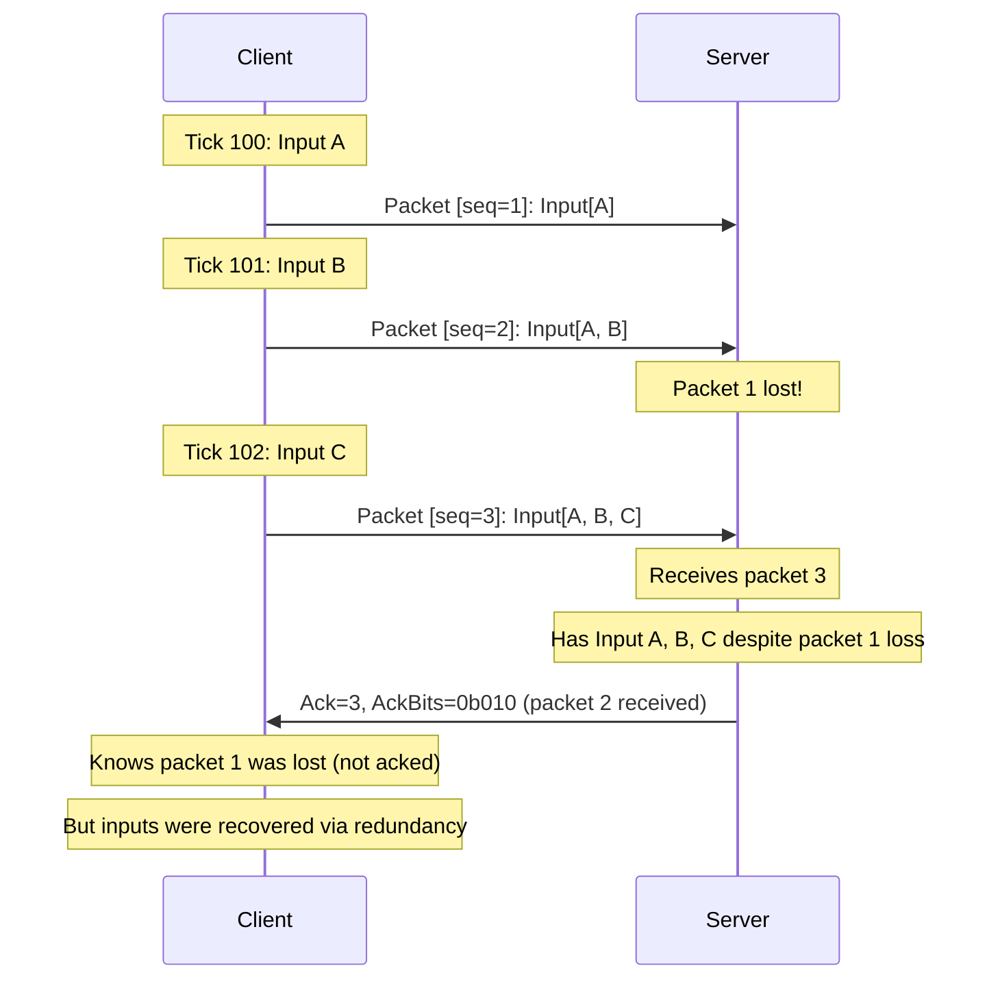
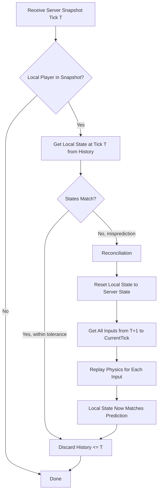
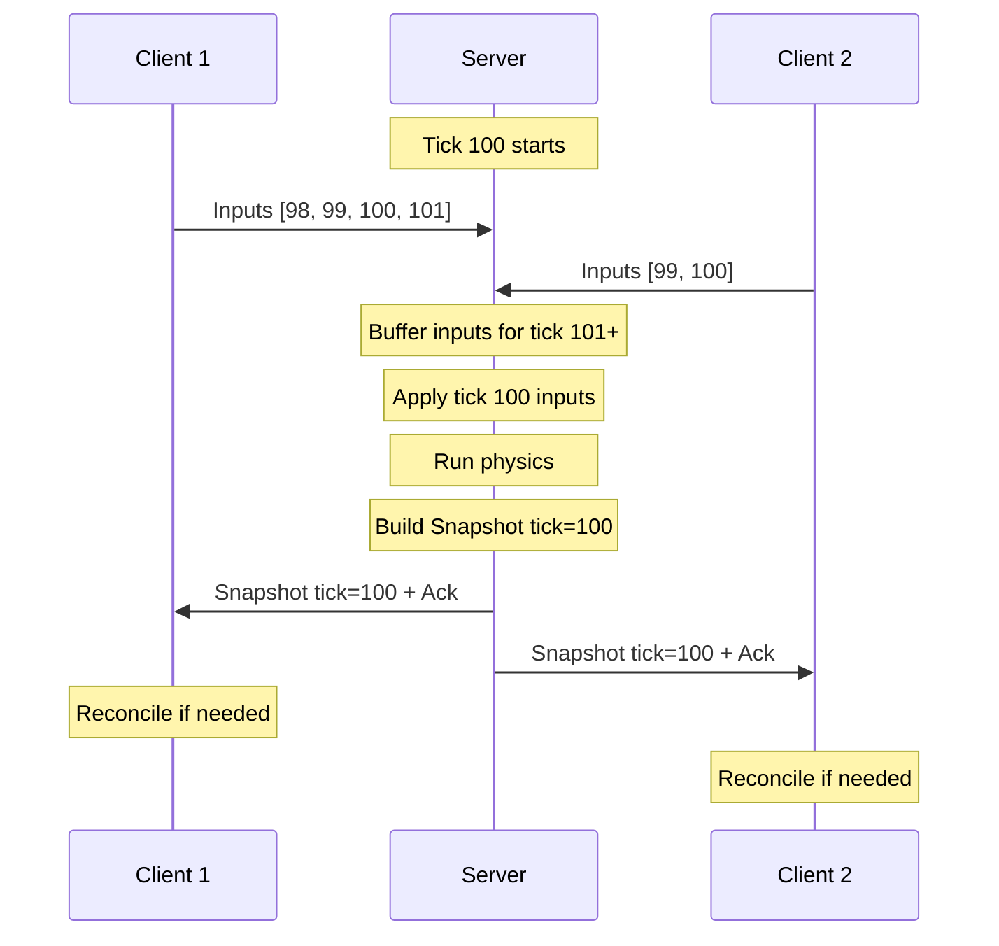
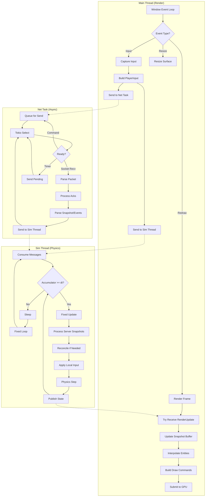
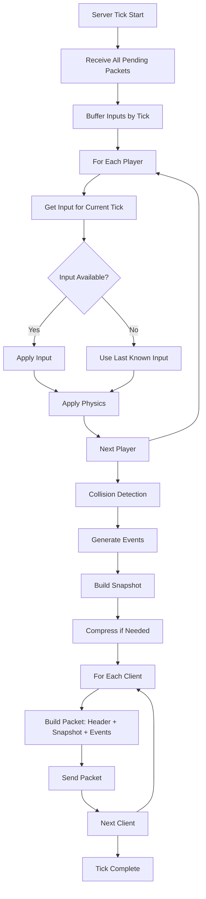
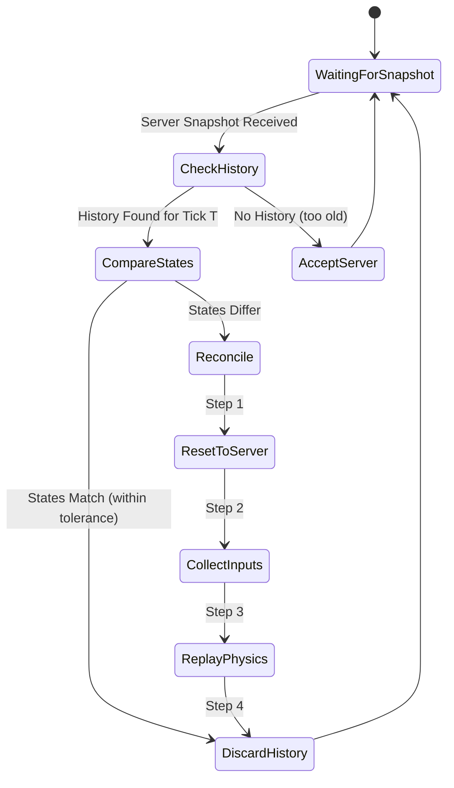

# Multiplayer FPS Implementation Details

This document provides detailed implementation examples for each subsystem described in [REPORT.md](REPORT.md).

---

## Table of Contents

1. [Core Data Structures](#1-core-data-structures)
2. [Threading & System Initialization](#2-threading--system-initialization)
3. [The Fixed Timestep Loop](#3-the-fixed-timestep-loop)
4. [Network Protocol Implementation](#4-network-protocol-implementation)
5. [Client-Side Prediction](#5-client-side-prediction)
6. [Server-Side Processing](#6-server-side-processing)
7. [Interpolation System](#7-interpolation-system)
8. [Event System](#8-event-system)
9. [Complete Flow Diagrams](#9-complete-flow-diagrams)

---

## 1. Core Data Structures

### 1.1 Shared Protocol Types

These types are shared between client and server (in a `protocol` crate).

```rust
// crates/protocol/src/lib.rs

use glam::{Vec3, Quat};
use rkyv::{Archive, Deserialize, Serialize};

/// Unique identifier for each tick of the simulation
pub type Tick = u32;

/// Unique identifier for each entity
pub type EntityId = u32;

/// Player input for a single tick
#[derive(Archive, Deserialize, Serialize, Clone, Debug, Default)]
#[archive(check_bytes)]
pub struct PlayerInput {
    pub tick: Tick,
    /// Bitfield: W=0x01, A=0x02, S=0x04, D=0x08, Jump=0x10, Crouch=0x20, Fire=0x40
    pub buttons: u8,
    /// View angles (yaw, pitch) in radians
    pub view_angles: [f32; 2],
    /// Mouse delta for this tick (used for smoothing)
    pub mouse_delta: [f32; 2],
}

impl PlayerInput {
    pub fn forward(&self) -> bool { self.buttons & 0x01 != 0 }
    pub fn left(&self) -> bool { self.buttons & 0x02 != 0 }
    pub fn backward(&self) -> bool { self.buttons & 0x04 != 0 }
    pub fn right(&self) -> bool { self.buttons & 0x08 != 0 }
    pub fn jump(&self) -> bool { self.buttons & 0x10 != 0 }
    pub fn crouch(&self) -> bool { self.buttons & 0x20 != 0 }
    pub fn fire(&self) -> bool { self.buttons & 0x40 != 0 }
}

/// State of a single player entity
#[derive(Archive, Deserialize, Serialize, Clone, Debug)]
#[archive(check_bytes)]
pub struct PlayerState {
    pub id: EntityId,
    pub position: [f32; 3],
    pub velocity: [f32; 3],
    pub view_angles: [f32; 2],
    pub health: u8,
    pub flags: u8, // 0x01 = on_ground, 0x02 = crouching
}

impl PlayerState {
    pub fn on_ground(&self) -> bool { self.flags & 0x01 != 0 }
    pub fn crouching(&self) -> bool { self.flags & 0x02 != 0 }
}

/// State of a projectile
#[derive(Archive, Deserialize, Serialize, Clone, Debug)]
#[archive(check_bytes)]
pub struct ProjectileState {
    pub id: EntityId,
    pub owner_id: EntityId,
    pub position: [f32; 3],
    pub velocity: [f32; 3],
    pub lifetime_remaining: f32,
}

/// Complete world state for a single tick
#[derive(Archive, Deserialize, Serialize, Clone, Debug)]
#[archive(check_bytes)]
pub struct WorldSnapshot {
    pub tick: Tick,
    pub timestamp_ms: u64,
    pub players: Vec<PlayerState>,
    pub projectiles: Vec<ProjectileState>,
}

/// One-shot game events (not part of continuous state)
#[derive(Archive, Deserialize, Serialize, Clone, Debug)]
#[archive(check_bytes)]
pub enum GameEvent {
    PlayerSpawned { id: EntityId, position: [f32; 3] },
    PlayerDied { id: EntityId, killer_id: EntityId },
    WeaponFired { owner_id: EntityId, weapon: u8, origin: [f32; 3], direction: [f32; 3] },
    Explosion { position: [f32; 3], radius: f32 },
    HitConfirm { target_id: EntityId, damage: u8 },
}

/// Network packet header for reliability
#[derive(Archive, Deserialize, Serialize, Clone, Debug)]
#[archive(check_bytes)]
pub struct PacketHeader {
    /// Protocol magic number for validation
    pub protocol_id: u32,
    /// This packet's sequence number
    pub sequence: u16,
    /// Remote sequence number we're acknowledging
    pub ack: u16,
    /// Bitfield for previous 32 acks (relative to `ack`)
    pub ack_bits: u32,
}

pub const PROTOCOL_ID: u32 = 0x44554C31; // "DUL1"
```

### 1.2 Client-Specific Types

```rust
// crates/client/src/game/types.rs

use protocol::{PlayerInput, PlayerState, Tick, WorldSnapshot};
use std::collections::VecDeque;

/// Timestamped snapshot for interpolation
#[derive(Clone, Debug)]
pub struct TimestampedSnapshot {
    pub snapshot: WorldSnapshot,
    pub received_time: std::time::Instant,
}

/// Buffer of recent snapshots for interpolation
pub struct SnapshotBuffer {
    /// Ring buffer of snapshots, ordered by tick
    pub snapshots: VecDeque<TimestampedSnapshot>,
    /// Maximum number of snapshots to retain
    pub max_size: usize,
}

impl SnapshotBuffer {
    pub fn new(max_size: usize) -> Self {
        Self {
            snapshots: VecDeque::with_capacity(max_size),
            max_size,
        }
    }

    /// Insert a snapshot, maintaining tick order
    pub fn insert(&mut self, snapshot: TimestampedSnapshot) {
        // Find insertion point (usually at the end)
        let pos = self.snapshots
            .iter()
            .position(|s| s.snapshot.tick > snapshot.snapshot.tick)
            .unwrap_or(self.snapshots.len());
        
        self.snapshots.insert(pos, snapshot);
        
        // Evict old snapshots
        while self.snapshots.len() > self.max_size {
            self.snapshots.pop_front();
        }
    }

    /// Get two snapshots surrounding the given tick for interpolation
    pub fn get_interpolation_pair(&self, tick: Tick) -> Option<(&TimestampedSnapshot, &TimestampedSnapshot, f32)> {
        if self.snapshots.len() < 2 {
            return None;
        }

        for i in 0..self.snapshots.len() - 1 {
            let a = &self.snapshots[i];
            let b = &self.snapshots[i + 1];
            
            if a.snapshot.tick <= tick && b.snapshot.tick > tick {
                let alpha = (tick - a.snapshot.tick) as f32 
                          / (b.snapshot.tick - a.snapshot.tick) as f32;
                return Some((a, b, alpha));
            }
        }
        
        None
    }
}

/// History of inputs for prediction reconciliation
pub struct InputHistory {
    /// Map of tick -> input
    pub inputs: VecDeque<PlayerInput>,
    /// Maximum ticks to retain
    pub max_size: usize,
}

impl InputHistory {
    pub fn new(max_size: usize) -> Self {
        Self {
            inputs: VecDeque::with_capacity(max_size),
            max_size,
        }
    }

    pub fn push(&mut self, input: PlayerInput) {
        self.inputs.push_back(input);
        while self.inputs.len() > self.max_size {
            self.inputs.pop_front();
        }
    }

    /// Remove all inputs older than the given tick
    pub fn acknowledge_up_to(&mut self, tick: Tick) {
        while let Some(front) = self.inputs.front() {
            if front.tick <= tick {
                self.inputs.pop_front();
            } else {
                break;
            }
        }
    }

    /// Get all inputs from `start_tick` onwards (for replay)
    pub fn inputs_since(&self, start_tick: Tick) -> impl Iterator<Item = &PlayerInput> {
        self.inputs.iter().filter(move |i| i.tick > start_tick)
    }
}
```

---

## 2. Threading & System Initialization

### 2.1 System Coordinator

```rust
// crates/client/src/system/mod.rs

use std::sync::Arc;
use std::thread;
use tokio::sync::mpsc;
use parking_lot::RwLock;

use protocol::{PlayerInput, WorldSnapshot, GameEvent};

/// Messages from Main Thread -> Simulation Thread
pub enum SimCommand {
    /// New input from the player
    Input(PlayerInput),
    /// Server snapshot received
    ServerSnapshot(WorldSnapshot),
    /// Server events received
    ServerEvents(Vec<GameEvent>),
    /// Shutdown signal
    Shutdown,
}

/// Messages from Simulation Thread -> Main Thread
pub enum RenderUpdate {
    /// New predicted state available
    PredictedState(Arc<WorldSnapshot>),
    /// Events to be rendered (sounds, particles)
    Events(Vec<GameEvent>),
}

/// Messages to Network Task
pub enum NetCommand {
    /// Send input to server
    SendInput(PlayerInput),
    /// Send reliable message
    SendReliable(Vec<u8>),
    /// Shutdown
    Shutdown,
}

/// Messages from Network Task
pub enum NetEvent {
    /// Received snapshot from server
    Snapshot(WorldSnapshot),
    /// Received events from server
    Events(Vec<GameEvent>),
    /// Connection state changed
    ConnectionState(ConnectionState),
}

#[derive(Clone, Copy, Debug)]
pub enum ConnectionState {
    Connecting,
    Connected,
    Disconnected,
}

/// Central coordinator that spawns and manages all subsystems
pub struct SystemCoordinator {
    // Channels
    pub sim_tx: mpsc::Sender<SimCommand>,
    pub render_rx: mpsc::Receiver<RenderUpdate>,
    pub net_cmd_tx: mpsc::Sender<NetCommand>,
    
    // Shared state (for emergency access, prefer channels)
    pub latest_state: Arc<RwLock<Option<Arc<WorldSnapshot>>>>,
    
    // Thread handles
    sim_handle: Option<thread::JoinHandle<()>>,
    net_handle: Option<tokio::task::JoinHandle<()>>,
}

impl SystemCoordinator {
    pub fn new(server_addr: std::net::SocketAddr) -> Self {
        // Create channels
        let (sim_tx, sim_rx) = mpsc::channel::<SimCommand>(256);
        let (render_tx, render_rx) = mpsc::channel::<RenderUpdate>(64);
        let (net_cmd_tx, net_cmd_rx) = mpsc::channel::<NetCommand>(256);
        let (net_event_tx, net_event_rx) = mpsc::channel::<NetEvent>(256);
        
        let latest_state = Arc::new(RwLock::new(None));
        let latest_state_clone = latest_state.clone();
        
        // Spawn Simulation Thread
        let sim_handle = thread::Builder::new()
            .name("simulation".into())
            .spawn(move || {
                let mut sim = SimulationLoop::new(sim_rx, render_tx, net_event_rx, latest_state_clone);
                sim.run();
            })
            .expect("Failed to spawn simulation thread");
        
        // Spawn Network Task (on tokio runtime)
        let net_handle = tokio::spawn(async move {
            let mut net = NetworkLoop::new(server_addr, net_cmd_rx, net_event_tx);
            net.run().await;
        });
        
        Self {
            sim_tx,
            render_rx,
            net_cmd_tx,
            latest_state,
            sim_handle: Some(sim_handle),
            net_handle: Some(net_handle),
        }
    }
    
    pub fn shutdown(&mut self) {
        // Signal shutdown
        let _ = self.sim_tx.blocking_send(SimCommand::Shutdown);
        let _ = self.net_cmd_tx.blocking_send(NetCommand::Shutdown);
        
        // Wait for threads
        if let Some(handle) = self.sim_handle.take() {
            let _ = handle.join();
        }
    }
}
```

### 2.2 Main Entry Point Integration

```rust
// crates/client/src/main.rs

mod app;
mod system;
mod game;
mod render;
mod net;

use std::sync::Arc;
use tokio::runtime::Runtime;
use winit::event_loop::EventLoop;

fn main() -> anyhow::Result<()> {
    env_logger::init();
    
    // Create tokio runtime for async networking
    let rt = Runtime::new()?;
    let _guard = rt.enter();
    
    // Parse server address from args or use default
    let server_addr = std::env::args()
        .nth(1)
        .and_then(|s| s.parse().ok())
        .unwrap_or_else(|| "127.0.0.1:7777".parse().unwrap());
    
    // Initialize system coordinator (spawns sim + net threads)
    let system = system::SystemCoordinator::new(server_addr);
    
    // Run winit event loop (this blocks until exit)
    let event_loop = EventLoop::new()?;
    let mut app = app::App::new(system);
    event_loop.run_app(&mut app)?;
    
    Ok(())
}
```

---

## 3. The Fixed Timestep Loop

### 3.1 Complete Simulation Loop Implementation

```rust
// crates/client/src/game/simulation.rs

use std::sync::Arc;
use std::time::{Duration, Instant};
use std::collections::VecDeque;
use tokio::sync::mpsc;
use parking_lot::RwLock;

use protocol::{PlayerInput, PlayerState, WorldSnapshot, GameEvent, Tick};
use crate::system::{SimCommand, RenderUpdate, NetEvent};
use crate::game::physics;

const TICK_RATE: f32 = 60.0;
const TICK_DURATION: Duration = Duration::from_nanos((1_000_000_000.0 / TICK_RATE) as u64);
const MAX_ACCUMULATED_TIME: Duration = Duration::from_millis(250); // Spiral of death protection

pub struct SimulationLoop {
    // Channels
    sim_rx: mpsc::Receiver<SimCommand>,
    render_tx: mpsc::Sender<RenderUpdate>,
    net_event_rx: mpsc::Receiver<NetEvent>,
    
    // Shared state output
    latest_state: Arc<RwLock<Option<Arc<WorldSnapshot>>>>,
    
    // Simulation state
    current_tick: Tick,
    current_state: WorldSnapshot,
    
    // Input handling
    pending_inputs: VecDeque<PlayerInput>,
    input_history: VecDeque<PlayerInput>,
    
    // Server reconciliation
    last_server_tick: Tick,
    server_snapshots: VecDeque<WorldSnapshot>,
    
    // Timing
    accumulator: Duration,
    last_update: Instant,
    
    // Local player ID (assigned by server)
    local_player_id: Option<u32>,
}

impl SimulationLoop {
    pub fn new(
        sim_rx: mpsc::Receiver<SimCommand>,
        render_tx: mpsc::Sender<RenderUpdate>,
        net_event_rx: mpsc::Receiver<NetEvent>,
        latest_state: Arc<RwLock<Option<Arc<WorldSnapshot>>>>,
    ) -> Self {
        Self {
            sim_rx,
            render_tx,
            net_event_rx,
            latest_state,
            current_tick: 0,
            current_state: WorldSnapshot {
                tick: 0,
                timestamp_ms: 0,
                players: Vec::new(),
                projectiles: Vec::new(),
            },
            pending_inputs: VecDeque::with_capacity(16),
            input_history: VecDeque::with_capacity(128),
            last_server_tick: 0,
            server_snapshots: VecDeque::with_capacity(32),
            accumulator: Duration::ZERO,
            last_update: Instant::now(),
            local_player_id: None,
        }
    }

    pub fn run(&mut self) {
        log::info!("Simulation loop started");
        
        loop {
            // === PHASE 1: Process incoming messages (non-blocking) ===
            if !self.process_messages() {
                break; // Shutdown requested
            }
            
            // === PHASE 2: Timing update ===
            let now = Instant::now();
            let frame_time = now.duration_since(self.last_update);
            self.last_update = now;
            
            // Accumulate time, with spiral of death protection
            self.accumulator += frame_time;
            if self.accumulator > MAX_ACCUMULATED_TIME {
                log::warn!("Simulation falling behind, clamping accumulator");
                self.accumulator = MAX_ACCUMULATED_TIME;
            }
            
            // === PHASE 3: Fixed timestep updates ===
            while self.accumulator >= TICK_DURATION {
                self.fixed_update();
                self.accumulator -= TICK_DURATION;
            }
            
            // === PHASE 4: Publish state to render thread ===
            self.publish_state();
            
            // === PHASE 5: Sleep to prevent CPU spinning ===
            // Sleep for remaining time minus a small margin
            let remaining = TICK_DURATION.saturating_sub(self.accumulator);
            if remaining > Duration::from_micros(500) {
                std::thread::sleep(remaining - Duration::from_micros(500));
            }
        }
        
        log::info!("Simulation loop ended");
    }

    /// Process all pending messages from channels. Returns false if shutdown requested.
    fn process_messages(&mut self) -> bool {
        // Process simulation commands (from main thread)
        while let Ok(cmd) = self.sim_rx.try_recv() {
            match cmd {
                SimCommand::Input(input) => {
                    self.pending_inputs.push_back(input);
                }
                SimCommand::ServerSnapshot(snapshot) => {
                    self.server_snapshots.push_back(snapshot);
                }
                SimCommand::ServerEvents(events) => {
                    // Forward events to render thread immediately
                    let _ = self.render_tx.try_send(RenderUpdate::Events(events));
                }
                SimCommand::Shutdown => {
                    return false;
                }
            }
        }
        
        // Process network events
        while let Ok(event) = self.net_event_rx.try_recv() {
            match event {
                NetEvent::Snapshot(snapshot) => {
                    self.server_snapshots.push_back(snapshot);
                }
                NetEvent::Events(events) => {
                    let _ = self.render_tx.try_send(RenderUpdate::Events(events));
                }
                NetEvent::ConnectionState(_state) => {
                    // Handle connection state changes
                }
            }
        }
        
        true
    }

    /// Execute one fixed timestep update
    fn fixed_update(&mut self) {
        self.current_tick += 1;
        
        // === STEP 1: Process server snapshots (reconciliation) ===
        self.process_server_snapshots();
        
        // === STEP 2: Get input for this tick ===
        let input = self.get_input_for_tick();
        
        // === STEP 3: Store input in history (for reconciliation) ===
        if let Some(ref input) = input {
            let mut input_clone = input.clone();
            input_clone.tick = self.current_tick;
            self.input_history.push_back(input_clone);
            
            // Limit history size
            while self.input_history.len() > 128 {
                self.input_history.pop_front();
            }
        }
        
        // === STEP 4: Apply physics for local player (prediction) ===
        if let Some(player_id) = self.local_player_id {
            self.apply_local_player_physics(player_id, input.as_ref());
        }
        
        // === STEP 5: Update all other entities (interpolation targets) ===
        self.update_other_entities();
        
        // === STEP 6: Update projectiles ===
        self.update_projectiles();
        
        // === STEP 7: Update tick timestamp ===
        self.current_state.tick = self.current_tick;
        self.current_state.timestamp_ms = std::time::SystemTime::now()
            .duration_since(std::time::UNIX_EPOCH)
            .unwrap()
            .as_millis() as u64;
    }

    /// Process any pending server snapshots and reconcile prediction
    fn process_server_snapshots(&mut self) {
        while let Some(server_snapshot) = self.server_snapshots.pop_front() {
            // Skip if we've already processed a newer snapshot
            if server_snapshot.tick <= self.last_server_tick {
                continue;
            }
            
            self.last_server_tick = server_snapshot.tick;
            
            // === RECONCILIATION ===
            if let Some(player_id) = self.local_player_id {
                self.reconcile(player_id, &server_snapshot);
            }
            
            // Update other players' states (they will be interpolated in render)
            for server_player in &server_snapshot.players {
                if Some(server_player.id) != self.local_player_id {
                    // Update or insert remote player
                    if let Some(local_player) = self.current_state.players
                        .iter_mut()
                        .find(|p| p.id == server_player.id)
                    {
                        *local_player = server_player.clone();
                    } else {
                        self.current_state.players.push(server_player.clone());
                    }
                }
            }
            
            // Remove players that no longer exist on server
            let server_ids: Vec<_> = server_snapshot.players.iter().map(|p| p.id).collect();
            self.current_state.players.retain(|p| server_ids.contains(&p.id));
            
            // Acknowledge inputs up to server tick
            self.input_history.retain(|i| i.tick > server_snapshot.tick);
        }
    }

    /// Reconcile local player prediction with server state
    fn reconcile(&mut self, player_id: u32, server_snapshot: &WorldSnapshot) {
        let Some(server_player) = server_snapshot.players.iter().find(|p| p.id == player_id) else {
            return;
        };
        
        let Some(local_player) = self.current_state.players.iter_mut().find(|p| p.id == player_id) else {
            return;
        };
        
        // Check if prediction error is significant
        let pos_error = glam::Vec3::from(server_player.position)
            .distance(glam::Vec3::from(local_player.position));
        
        const RECONCILE_THRESHOLD: f32 = 0.1; // 10cm
        
        if pos_error > RECONCILE_THRESHOLD {
            log::debug!(
                "Reconciling: error={:.3}m, server_tick={}, current_tick={}",
                pos_error, server_snapshot.tick, self.current_tick
            );
            
            // === STEP 1: Reset to server state ===
            *local_player = server_player.clone();
            
            // === STEP 2: Replay all inputs since server tick ===
            for input in self.input_history.iter() {
                if input.tick > server_snapshot.tick {
                    physics::apply_player_input(local_player, input, 1.0 / TICK_RATE);
                }
            }
        }
    }

    fn get_input_for_tick(&mut self) -> Option<PlayerInput> {
        self.pending_inputs.pop_front()
    }

    fn apply_local_player_physics(&mut self, player_id: u32, input: Option<&PlayerInput>) {
        let Some(player) = self.current_state.players.iter_mut().find(|p| p.id == player_id) else {
            return;
        };
        
        if let Some(input) = input {
            physics::apply_player_input(player, input, 1.0 / TICK_RATE);
        }
        
        physics::apply_gravity_and_collision(player, 1.0 / TICK_RATE);
    }

    fn update_other_entities(&mut self) {
        // Other players are updated from server snapshots, not predicted
        // This is intentional - we only predict the local player
    }

    fn update_projectiles(&mut self) {
        let dt = 1.0 / TICK_RATE;
        
        self.current_state.projectiles.retain_mut(|proj| {
            // Update position
            proj.position[0] += proj.velocity[0] * dt;
            proj.position[1] += proj.velocity[1] * dt;
            proj.position[2] += proj.velocity[2] * dt;
            
            // Apply gravity
            proj.velocity[1] -= 9.81 * dt;
            
            // Decrease lifetime
            proj.lifetime_remaining -= dt;
            
            // Keep if still alive
            proj.lifetime_remaining > 0.0
        });
    }

    fn publish_state(&self) {
        let state = Arc::new(self.current_state.clone());
        
        // Update shared state (for emergency access)
        *self.latest_state.write() = Some(state.clone());
        
        // Send to render thread via channel
        let _ = self.render_tx.try_send(RenderUpdate::PredictedState(state));
    }
}
```

### 3.2 Physics Module

```rust
// crates/client/src/game/physics.rs

use protocol::{PlayerInput, PlayerState};
use glam::Vec3;

const MOVE_SPEED: f32 = 7.0;
const JUMP_VELOCITY: f32 = 8.0;
const GRAVITY: f32 = 20.0;
const GROUND_LEVEL: f32 = 0.0;

/// Apply player input to update velocity and view angles
pub fn apply_player_input(player: &mut PlayerState, input: &PlayerInput, dt: f32) {
    // Update view angles
    player.view_angles = input.view_angles;
    
    // Calculate movement direction in world space
    let yaw = input.view_angles[0];
    let forward = Vec3::new(-yaw.sin(), 0.0, -yaw.cos());
    let right = Vec3::new(yaw.cos(), 0.0, -yaw.sin());
    
    let mut move_dir = Vec3::ZERO;
    
    if input.forward() { move_dir += forward; }
    if input.backward() { move_dir -= forward; }
    if input.left() { move_dir -= right; }
    if input.right() { move_dir += right; }
    
    // Normalize and apply speed
    if move_dir.length_squared() > 0.0 {
        move_dir = move_dir.normalize() * MOVE_SPEED;
    }
    
    // Set horizontal velocity (instant acceleration for responsive feel)
    player.velocity[0] = move_dir.x;
    player.velocity[2] = move_dir.z;
    
    // Handle jumping
    if input.jump() && player.on_ground() {
        player.velocity[1] = JUMP_VELOCITY;
        player.flags &= !0x01; // Clear on_ground flag
    }
}

/// Apply gravity and ground collision
pub fn apply_gravity_and_collision(player: &mut PlayerState, dt: f32) {
    // Apply gravity
    player.velocity[1] -= GRAVITY * dt;
    
    // Integrate position
    player.position[0] += player.velocity[0] * dt;
    player.position[1] += player.velocity[1] * dt;
    player.position[2] += player.velocity[2] * dt;
    
    // Ground collision
    if player.position[1] <= GROUND_LEVEL {
        player.position[1] = GROUND_LEVEL;
        player.velocity[1] = 0.0;
        player.flags |= 0x01; // Set on_ground flag
    }
}

/// Check if two player states are "close enough" (for reconciliation checks)
pub fn states_approximately_equal(a: &PlayerState, b: &PlayerState, tolerance: f32) -> bool {
    let pos_a = Vec3::from(a.position);
    let pos_b = Vec3::from(b.position);
    pos_a.distance(pos_b) <= tolerance
}
```

---

## 4. Network Protocol Implementation

### 4.1 Reliability Layer

```rust
// crates/client/src/net/reliability.rs

use std::collections::VecDeque;
use std::time::{Duration, Instant};

const MAX_SEQUENCE: u16 = u16::MAX;
const ACK_BUFFER_SIZE: usize = 33; // Current + 32 bits

/// Tracks sent packets for acknowledgment
pub struct SentPacketBuffer {
    packets: VecDeque<SentPacket>,
    max_entries: usize,
}

struct SentPacket {
    sequence: u16,
    sent_time: Instant,
    acked: bool,
    payload_type: PacketType,
}

#[derive(Clone, Copy, Debug)]
pub enum PacketType {
    Input,
    Reliable,
    Unreliable,
}

impl SentPacketBuffer {
    pub fn new(max_entries: usize) -> Self {
        Self {
            packets: VecDeque::with_capacity(max_entries),
            max_entries,
        }
    }

    pub fn insert(&mut self, sequence: u16, payload_type: PacketType) {
        self.packets.push_back(SentPacket {
            sequence,
            sent_time: Instant::now(),
            acked: false,
            payload_type,
        });
        
        while self.packets.len() > self.max_entries {
            self.packets.pop_front();
        }
    }

    /// Process an ack and return which packets were newly acknowledged
    pub fn process_ack(&mut self, ack: u16, ack_bits: u32) -> Vec<u16> {
        let mut newly_acked = Vec::new();
        
        for packet in self.packets.iter_mut() {
            if packet.acked {
                continue;
            }
            
            let acked = if packet.sequence == ack {
                true
            } else {
                // Check if this sequence is in the ack_bits
                let diff = sequence_diff(ack, packet.sequence);
                if diff > 0 && diff <= 32 {
                    (ack_bits & (1 << (diff - 1))) != 0
                } else {
                    false
                }
            };
            
            if acked {
                packet.acked = true;
                newly_acked.push(packet.sequence);
            }
        }
        
        newly_acked
    }

    /// Get packets that need resending (sent but not acked after timeout)
    pub fn get_packets_for_resend(&self, timeout: Duration) -> Vec<u16> {
        let now = Instant::now();
        self.packets
            .iter()
            .filter(|p| !p.acked && now.duration_since(p.sent_time) > timeout)
            .filter(|p| matches!(p.payload_type, PacketType::Reliable))
            .map(|p| p.sequence)
            .collect()
    }
}

/// Tracks received packets for generating acks
pub struct ReceivedPacketBuffer {
    /// Most recent received sequence
    most_recent: u16,
    /// Bitfield of received packets (relative to most_recent)
    received_bits: u32,
    /// Tracks which sequences we've seen
    seen: [bool; ACK_BUFFER_SIZE],
}

impl ReceivedPacketBuffer {
    pub fn new() -> Self {
        Self {
            most_recent: 0,
            received_bits: 0,
            seen: [false; ACK_BUFFER_SIZE],
        }
    }

    /// Record a received packet. Returns true if this is a new packet.
    pub fn record(&mut self, sequence: u16) -> bool {
        if self.seen.iter().all(|&s| !s) {
            // First packet ever
            self.most_recent = sequence;
            self.seen[0] = true;
            return true;
        }
        
        let diff = sequence_diff(sequence, self.most_recent);
        
        if diff > 0 {
            // Newer packet - shift the window
            let shift = diff.min(32) as usize;
            
            // Shift received_bits
            self.received_bits <<= shift;
            if shift <= 32 {
                self.received_bits |= 1 << (shift - 1); // Mark old most_recent
            }
            
            // Update most_recent
            self.most_recent = sequence;
            
            // Shift seen array
            self.seen.rotate_right(shift);
            for i in 0..shift {
                self.seen[i] = false;
            }
            self.seen[0] = true;
            
            true
        } else if diff < 0 {
            // Older packet - check if we've seen it
            let index = (-diff) as usize;
            if index < ACK_BUFFER_SIZE {
                if self.seen[index] {
                    false // Duplicate
                } else {
                    self.seen[index] = true;
                    if index <= 32 {
                        self.received_bits |= 1 << (index - 1);
                    }
                    true
                }
            } else {
                false // Too old
            }
        } else {
            // Same sequence (duplicate)
            false
        }
    }

    /// Get current ack info to send
    pub fn get_ack_info(&self) -> (u16, u32) {
        (self.most_recent, self.received_bits)
    }
}

/// Calculate signed difference between two sequence numbers (handles wrap-around)
fn sequence_diff(a: u16, b: u16) -> i32 {
    let diff = a.wrapping_sub(b) as i16;
    diff as i32
}

#[cfg(test)]
mod tests {
    use super::*;

    #[test]
    fn test_sequence_diff() {
        assert_eq!(sequence_diff(5, 3), 2);
        assert_eq!(sequence_diff(3, 5), -2);
        assert_eq!(sequence_diff(0, 65535), 1); // Wrap around
        assert_eq!(sequence_diff(65535, 0), -1);
    }

    #[test]
    fn test_received_buffer() {
        let mut buf = ReceivedPacketBuffer::new();
        
        assert!(buf.record(1));
        assert!(!buf.record(1)); // Duplicate
        assert!(buf.record(2));
        assert!(buf.record(5)); // Skipped 3, 4
        
        let (ack, bits) = buf.get_ack_info();
        assert_eq!(ack, 5);
        assert_eq!(bits & 0b111, 0b011); // 4, 3 not received; 2, 1 received relative to 5
    }
}
```

### 4.2 Network Loop

```rust
// crates/client/src/net/loop.rs

use std::net::SocketAddr;
use std::time::{Duration, Instant};
use tokio::net::UdpSocket;
use tokio::sync::mpsc;

use protocol::{PacketHeader, PlayerInput, WorldSnapshot, GameEvent, PROTOCOL_ID};
use crate::system::{NetCommand, NetEvent, ConnectionState};
use super::reliability::{SentPacketBuffer, ReceivedPacketBuffer, PacketType};

const MAX_PACKET_SIZE: usize = 1200;
const SEND_RATE: Duration = Duration::from_millis(16); // ~60Hz
const TIMEOUT: Duration = Duration::from_millis(100);

pub struct NetworkLoop {
    server_addr: SocketAddr,
    cmd_rx: mpsc::Receiver<NetCommand>,
    event_tx: mpsc::Sender<NetEvent>,
    
    socket: Option<UdpSocket>,
    
    // Reliability
    local_sequence: u16,
    sent_buffer: SentPacketBuffer,
    received_buffer: ReceivedPacketBuffer,
    
    // Input redundancy
    recent_inputs: Vec<PlayerInput>,
    
    // Timing
    last_send_time: Instant,
}

impl NetworkLoop {
    pub fn new(
        server_addr: SocketAddr,
        cmd_rx: mpsc::Receiver<NetCommand>,
        event_tx: mpsc::Sender<NetEvent>,
    ) -> Self {
        Self {
            server_addr,
            cmd_rx,
            event_tx,
            socket: None,
            local_sequence: 0,
            sent_buffer: SentPacketBuffer::new(256),
            received_buffer: ReceivedPacketBuffer::new(),
            recent_inputs: Vec::with_capacity(4),
            last_send_time: Instant::now(),
        }
    }

    pub async fn run(&mut self) {
        // Bind socket
        let socket = match UdpSocket::bind("0.0.0.0:0").await {
            Ok(s) => s,
            Err(e) => {
                log::error!("Failed to bind UDP socket: {}", e);
                return;
            }
        };
        
        // Connect to server (sets default destination)
        if let Err(e) = socket.connect(self.server_addr).await {
            log::error!("Failed to connect to server: {}", e);
            return;
        }
        
        self.socket = Some(socket);
        let _ = self.event_tx.send(NetEvent::ConnectionState(ConnectionState::Connected)).await;
        
        log::info!("Connected to server at {}", self.server_addr);
        
        let mut recv_buf = [0u8; MAX_PACKET_SIZE];
        
        loop {
            let socket = self.socket.as_ref().unwrap();
            
            tokio::select! {
                // === Receive from network ===
                result = socket.recv(&mut recv_buf) => {
                    match result {
                        Ok(len) => self.handle_received_packet(&recv_buf[..len]).await,
                        Err(e) => log::warn!("Recv error: {}", e),
                    }
                }
                
                // === Process commands ===
                cmd = self.cmd_rx.recv() => {
                    match cmd {
                        Some(NetCommand::SendInput(input)) => {
                            self.queue_input(input);
                        }
                        Some(NetCommand::SendReliable(data)) => {
                            self.send_reliable(data).await;
                        }
                        Some(NetCommand::Shutdown) | None => {
                            break;
                        }
                    }
                }
                
                // === Periodic send ===
                _ = tokio::time::sleep(SEND_RATE) => {
                    self.send_pending().await;
                }
            }
        }
        
        let _ = self.event_tx.send(NetEvent::ConnectionState(ConnectionState::Disconnected)).await;
    }

    fn queue_input(&mut self, input: PlayerInput) {
        // Store for redundancy
        self.recent_inputs.push(input);
        if self.recent_inputs.len() > 4 {
            self.recent_inputs.remove(0);
        }
    }

    async fn send_pending(&mut self) {
        if self.recent_inputs.is_empty() {
            return;
        }
        
        let Some(socket) = &self.socket else { return };
        
        // Build packet with header + redundant inputs
        let mut packet = Vec::with_capacity(256);
        
        // Header
        let (ack, ack_bits) = self.received_buffer.get_ack_info();
        let header = PacketHeader {
            protocol_id: PROTOCOL_ID,
            sequence: self.local_sequence,
            ack,
            ack_bits,
        };
        
        // Serialize header
        let header_bytes = rkyv::to_bytes::<rkyv::rancor::Error>(&header).unwrap();
        packet.extend_from_slice(&header_bytes);
        
        // Serialize inputs (redundant - send last N)
        let inputs_bytes = rkyv::to_bytes::<rkyv::rancor::Error>(&self.recent_inputs).unwrap();
        packet.extend_from_slice(&inputs_bytes);
        
        // Send
        if let Err(e) = socket.send(&packet).await {
            log::warn!("Send error: {}", e);
        }
        
        // Track for ack
        self.sent_buffer.insert(self.local_sequence, PacketType::Input);
        self.local_sequence = self.local_sequence.wrapping_add(1);
        
        self.last_send_time = Instant::now();
    }

    async fn send_reliable(&mut self, _data: Vec<u8>) {
        // Similar to send_pending but with PacketType::Reliable
        // Implementation omitted for brevity
    }

    async fn handle_received_packet(&mut self, data: &[u8]) {
        if data.len() < 12 {
            return; // Too small for header
        }
        
        // Parse header (rkyv zero-copy)
        let header = match rkyv::access::<rkyv::Archived<PacketHeader>, rkyv::rancor::Error>(&data[..12]) {
            Ok(h) => h,
            Err(_) => return,
        };
        
        // Validate protocol
        if header.protocol_id != PROTOCOL_ID {
            return;
        }
        
        // Process acks
        let newly_acked = self.sent_buffer.process_ack(header.ack, header.ack_bits);
        if !newly_acked.is_empty() {
            log::trace!("Acked packets: {:?}", newly_acked);
        }
        
        // Record this packet for our acks
        if !self.received_buffer.record(header.sequence) {
            return; // Duplicate packet
        }
        
        // Parse payload
        let payload = &data[12..];
        if payload.is_empty() {
            return;
        }
        
        // Try to parse as snapshot
        if let Ok(snapshot) = rkyv::from_bytes::<WorldSnapshot, rkyv::rancor::Error>(payload) {
            let _ = self.event_tx.send(NetEvent::Snapshot(snapshot)).await;
        }
        
        // Try to parse as events (different packet type would be indicated by a type byte)
        // For simplicity, assuming snapshots for now
    }
}
```

### 4.3 Input Redundancy Diagram



---

## 5. Client-Side Prediction

### 5.1 Prediction Flow



### 5.2 State History Management

```rust
// crates/client/src/game/prediction.rs

use std::collections::VecDeque;
use protocol::{PlayerState, PlayerInput, Tick};
use crate::game::physics;

const HISTORY_SIZE: usize = 128;

/// Stores historical states for reconciliation
pub struct StateHistory {
    states: VecDeque<HistoryEntry>,
}

struct HistoryEntry {
    tick: Tick,
    state: PlayerState,
    input: PlayerInput,
}

impl StateHistory {
    pub fn new() -> Self {
        Self {
            states: VecDeque::with_capacity(HISTORY_SIZE),
        }
    }

    /// Record the state BEFORE applying input for this tick
    pub fn record(&mut self, tick: Tick, state: &PlayerState, input: &PlayerInput) {
        self.states.push_back(HistoryEntry {
            tick,
            state: state.clone(),
            input: input.clone(),
        });
        
        while self.states.len() > HISTORY_SIZE {
            self.states.pop_front();
        }
    }

    /// Get state at a specific tick (if still in history)
    pub fn get_state(&self, tick: Tick) -> Option<&PlayerState> {
        self.states.iter().find(|e| e.tick == tick).map(|e| &e.state)
    }

    /// Discard all entries older than or equal to tick
    pub fn discard_up_to(&mut self, tick: Tick) {
        while let Some(front) = self.states.front() {
            if front.tick <= tick {
                self.states.pop_front();
            } else {
                break;
            }
        }
    }

    /// Get all inputs after a given tick for replay
    pub fn inputs_after(&self, tick: Tick) -> Vec<&PlayerInput> {
        self.states
            .iter()
            .filter(|e| e.tick > tick)
            .map(|e| &e.input)
            .collect()
    }
}

/// Performs prediction reconciliation
pub fn reconcile(
    local_state: &mut PlayerState,
    server_state: &PlayerState,
    server_tick: Tick,
    history: &mut StateHistory,
    dt: f32,
) -> bool {
    // Get our historical state at the server's tick
    let Some(historical_state) = history.get_state(server_tick) else {
        // No history for this tick, just accept server state
        *local_state = server_state.clone();
        return true;
    };
    
    // Compare states
    let position_error = glam::Vec3::from(historical_state.position)
        .distance(glam::Vec3::from(server_state.position));
    
    const TOLERANCE: f32 = 0.01; // 1cm
    
    if position_error <= TOLERANCE {
        // Prediction was correct, just clean up history
        history.discard_up_to(server_tick);
        return false;
    }
    
    // === MISPREDICTION - RECONCILE ===
    log::debug!("Reconciling: error={:.3}m at tick {}", position_error, server_tick);
    
    // 1. Reset to server state
    *local_state = server_state.clone();
    
    // 2. Replay all inputs since server tick
    let inputs_to_replay = history.inputs_after(server_tick);
    for input in inputs_to_replay {
        physics::apply_player_input(local_state, input, dt);
        physics::apply_gravity_and_collision(local_state, dt);
    }
    
    // 3. Clean up old history
    history.discard_up_to(server_tick);
    
    true
}
```

---

## 6. Server-Side Processing

### 6.1 Server Game Loop

```rust
// crates/server/src/game/loop.rs

use std::collections::HashMap;
use std::time::{Duration, Instant};

use protocol::{PlayerInput, PlayerState, WorldSnapshot, GameEvent, EntityId, Tick};

const TICK_RATE: f32 = 60.0;
const TICK_DURATION: Duration = Duration::from_nanos((1_000_000_000.0 / TICK_RATE) as u64);

pub struct ServerGameLoop {
    current_tick: Tick,
    players: HashMap<EntityId, ServerPlayer>,
    pending_events: Vec<GameEvent>,
    
    // Input buffers per client
    input_buffers: HashMap<EntityId, InputBuffer>,
}

struct ServerPlayer {
    state: PlayerState,
    last_input_tick: Tick,
}

struct InputBuffer {
    inputs: Vec<PlayerInput>,
}

impl ServerGameLoop {
    pub fn new() -> Self {
        Self {
            current_tick: 0,
            players: HashMap::new(),
            pending_events: Vec::new(),
            input_buffers: HashMap::new(),
        }
    }

    /// Main server tick
    pub fn tick(&mut self) -> (WorldSnapshot, Vec<GameEvent>) {
        self.current_tick += 1;
        
        let dt = 1.0 / TICK_RATE;
        
        // === STEP 1: Process buffered inputs for all players ===
        for (player_id, player) in &mut self.players {
            if let Some(buffer) = self.input_buffers.get_mut(player_id) {
                // Find input for this tick (or use last known)
                let input = buffer.inputs
                    .iter()
                    .find(|i| i.tick == self.current_tick)
                    .cloned();
                
                if let Some(input) = input {
                    apply_player_input(&mut player.state, &input, dt);
                    player.last_input_tick = self.current_tick;
                }
                
                // Clean old inputs
                buffer.inputs.retain(|i| i.tick > self.current_tick);
            }
        }
        
        // === STEP 2: Physics for all players ===
        for player in self.players.values_mut() {
            apply_physics(&mut player.state, dt);
        }
        
        // === STEP 3: Collision detection ===
        self.check_collisions();
        
        // === STEP 4: Build snapshot ===
        let snapshot = WorldSnapshot {
            tick: self.current_tick,
            timestamp_ms: std::time::SystemTime::now()
                .duration_since(std::time::UNIX_EPOCH)
                .unwrap()
                .as_millis() as u64,
            players: self.players.values().map(|p| p.state.clone()).collect(),
            projectiles: Vec::new(),
        };
        
        // === STEP 5: Drain events ===
        let events = std::mem::take(&mut self.pending_events);
        
        (snapshot, events)
    }

    /// Receive input from a client (may arrive out of order)
    pub fn receive_inputs(&mut self, player_id: EntityId, inputs: Vec<PlayerInput>) {
        let buffer = self.input_buffers.entry(player_id).or_insert(InputBuffer {
            inputs: Vec::new(),
        });
        
        for input in inputs {
            // Only accept inputs for future ticks
            if input.tick > self.current_tick {
                // Avoid duplicates
                if !buffer.inputs.iter().any(|i| i.tick == input.tick) {
                    buffer.inputs.push(input);
                }
            }
        }
        
        // Sort by tick
        buffer.inputs.sort_by_key(|i| i.tick);
    }

    fn check_collisions(&mut self) {
        // Collision detection implementation
    }
}

fn apply_player_input(state: &mut PlayerState, input: &PlayerInput, dt: f32) {
    // Same as client physics
}

fn apply_physics(state: &mut PlayerState, dt: f32) {
    // Same as client physics
}
```

### 6.2 Server Network Flow



---

## 7. Interpolation System

### 7.1 Entity Interpolation for Rendering

```rust
// crates/client/src/render/interpolation.rs

use std::collections::HashMap;
use std::time::{Duration, Instant};
use glam::{Vec3, Quat};

use protocol::{WorldSnapshot, PlayerState, EntityId};
use crate::game::types::SnapshotBuffer;

/// Interpolation delay - we render "in the past"
const INTERPOLATION_DELAY: Duration = Duration::from_millis(100);

/// Interpolated state ready for rendering
pub struct InterpolatedEntity {
    pub id: EntityId,
    pub position: Vec3,
    pub rotation: Quat,
    pub velocity: Vec3,
}

pub struct InterpolationSystem {
    snapshot_buffer: SnapshotBuffer,
    start_time: Instant,
}

impl InterpolationSystem {
    pub fn new() -> Self {
        Self {
            snapshot_buffer: SnapshotBuffer::new(32),
            start_time: Instant::now(),
        }
    }

    /// Add a new snapshot from the network
    pub fn add_snapshot(&mut self, snapshot: WorldSnapshot, received_time: Instant) {
        self.snapshot_buffer.insert(crate::game::types::TimestampedSnapshot {
            snapshot,
            received_time,
        });
    }

    /// Get interpolated entities for the current render frame
    pub fn get_interpolated_entities(&self, local_player_id: Option<EntityId>) -> Vec<InterpolatedEntity> {
        let now = Instant::now();
        let render_time = now - INTERPOLATION_DELAY;
        
        // Find the two snapshots surrounding render_time
        let Some((before, after, alpha)) = self.find_interpolation_snapshots(render_time) else {
            // Not enough data yet, return empty or last known
            return self.get_latest_entities();
        };
        
        let mut result = Vec::new();
        
        // Interpolate each entity
        for after_player in &after.snapshot.players {
            // Skip local player (we use predicted state)
            if Some(after_player.id) == local_player_id {
                continue;
            }
            
            // Find matching player in 'before' snapshot
            let before_player = before.snapshot.players
                .iter()
                .find(|p| p.id == after_player.id);
            
            let interpolated = if let Some(before_player) = before_player {
                // Interpolate between two known states
                interpolate_player(before_player, after_player, alpha)
            } else {
                // New player, just use current state
                player_to_interpolated(after_player)
            };
            
            result.push(interpolated);
        }
        
        result
    }

    fn find_interpolation_snapshots(&self, render_time: Instant) -> Option<(&crate::game::types::TimestampedSnapshot, &crate::game::types::TimestampedSnapshot, f32)> {
        let snapshots = &self.snapshot_buffer.snapshots;
        
        if snapshots.len() < 2 {
            return None;
        }
        
        for i in 0..snapshots.len() - 1 {
            let before = &snapshots[i];
            let after = &snapshots[i + 1];
            
            if before.received_time <= render_time && after.received_time > render_time {
                let total_duration = after.received_time.duration_since(before.received_time);
                let elapsed = render_time.duration_since(before.received_time);
                let alpha = elapsed.as_secs_f32() / total_duration.as_secs_f32();
                return Some((before, after, alpha.clamp(0.0, 1.0)));
            }
        }
        
        None
    }

    fn get_latest_entities(&self) -> Vec<InterpolatedEntity> {
        self.snapshot_buffer.snapshots
            .back()
            .map(|s| s.snapshot.players.iter().map(player_to_interpolated).collect())
            .unwrap_or_default()
    }
}

fn interpolate_player(before: &PlayerState, after: &PlayerState, alpha: f32) -> InterpolatedEntity {
    let pos_before = Vec3::from(before.position);
    let pos_after = Vec3::from(after.position);
    
    let rot_before = Quat::from_euler(
        glam::EulerRot::YXZ,
        before.view_angles[0],
        before.view_angles[1],
        0.0,
    );
    let rot_after = Quat::from_euler(
        glam::EulerRot::YXZ,
        after.view_angles[0],
        after.view_angles[1],
        0.0,
    );
    
    InterpolatedEntity {
        id: after.id,
        position: pos_before.lerp(pos_after, alpha),
        rotation: rot_before.slerp(rot_after, alpha),
        velocity: Vec3::from(after.velocity),
    }
}

fn player_to_interpolated(player: &PlayerState) -> InterpolatedEntity {
    InterpolatedEntity {
        id: player.id,
        position: Vec3::from(player.position),
        rotation: Quat::from_euler(
            glam::EulerRot::YXZ,
            player.view_angles[0],
            player.view_angles[1],
            0.0,
        ),
        velocity: Vec3::from(player.velocity),
    }
}
```

### 7.2 Interpolation Timeline

```mermaid
gantt
    title Interpolation Timeline
    dateFormat X
    axisFormat %L

    section Server
    Tick 1 :s1, 0, 16
    Tick 2 :s2, 16, 33
    Tick 3 :s3, 33, 50
    Tick 4 :s4, 50, 66
    Tick 5 :s5, 66, 83

    section Network Delay (~50ms)
    Packet 1 Transit :p1, 0, 50
    Packet 2 Transit :p2, 16, 66
    Packet 3 Transit :p3, 33, 83

    section Client Buffer
    Receive Tick 1 :r1, 50, 51
    Receive Tick 2 :r2, 66, 67
    Receive Tick 3 :r3, 83, 84

    section Client Render (100ms behind)
    Interpolating 1-2 :i1, 150, 166
    Interpolating 2-3 :i2, 166, 183
```



---

## 8. Event System

### 8.1 Event Processing

```rust
// crates/client/src/game/events.rs

use std::collections::VecDeque;
use protocol::{GameEvent, Tick};

/// Events attached to a specific tick
pub struct TickEvents {
    pub tick: Tick,
    pub events: Vec<GameEvent>,
}

/// Ring buffer of events, preventing duplicate processing
pub struct EventBuffer {
    events: VecDeque<TickEvents>,
    last_processed_tick: Tick,
    max_size: usize,
}

impl EventBuffer {
    pub fn new(max_size: usize) -> Self {
        Self {
            events: VecDeque::with_capacity(max_size),
            last_processed_tick: 0,
            max_size,
        }
    }

    /// Add events from a server packet
    pub fn add_events(&mut self, tick: Tick, events: Vec<GameEvent>) {
        // Don't add if we've already processed this tick
        if tick <= self.last_processed_tick {
            return;
        }
        
        // Check for duplicates
        if self.events.iter().any(|e| e.tick == tick) {
            return;
        }
        
        self.events.push_back(TickEvents { tick, events });
        
        // Sort by tick
        self.events.make_contiguous().sort_by_key(|e| e.tick);
        
        // Evict old
        while self.events.len() > self.max_size {
            self.events.pop_front();
        }
    }

    /// Get events ready to be processed (up to render_tick)
    pub fn drain_ready(&mut self, render_tick: Tick) -> Vec<GameEvent> {
        let mut result = Vec::new();
        
        while let Some(front) = self.events.front() {
            if front.tick <= render_tick && front.tick > self.last_processed_tick {
                let entry = self.events.pop_front().unwrap();
                self.last_processed_tick = entry.tick;
                result.extend(entry.events);
            } else {
                break;
            }
        }
        
        result
    }
}

/// Process events for rendering effects
pub fn process_events(events: Vec<GameEvent>, audio: &mut AudioSystem, particles: &mut ParticleSystem) {
    for event in events {
        match event {
            GameEvent::WeaponFired { owner_id, weapon, origin, direction } => {
                // Play gunshot sound
                audio.play_3d("gunshot", origin.into());
                
                // Spawn muzzle flash particle
                particles.spawn_muzzle_flash(origin.into(), direction.into());
            }
            
            GameEvent::Explosion { position, radius } => {
                // Play explosion sound
                audio.play_3d("explosion", position.into());
                
                // Spawn explosion particles
                particles.spawn_explosion(position.into(), radius);
            }
            
            GameEvent::HitConfirm { target_id, damage } => {
                // Play hit marker sound
                audio.play_2d("hitmarker");
            }
            
            GameEvent::PlayerDied { id, killer_id } => {
                // Log kill
                log::info!("Player {} killed by {}", id, killer_id);
            }
            
            GameEvent::PlayerSpawned { id, position } => {
                // Spawn effect
                particles.spawn_teleport(position.into());
            }
        }
    }
}

// Placeholder types
pub struct AudioSystem;
impl AudioSystem {
    pub fn play_3d(&mut self, _name: &str, _pos: glam::Vec3) {}
    pub fn play_2d(&mut self, _name: &str) {}
}

pub struct ParticleSystem;
impl ParticleSystem {
    pub fn spawn_muzzle_flash(&mut self, _pos: glam::Vec3, _dir: glam::Vec3) {}
    pub fn spawn_explosion(&mut self, _pos: glam::Vec3, _radius: f32) {}
    pub fn spawn_teleport(&mut self, _pos: glam::Vec3) {}
}
```

---

## 9. Complete Flow Diagrams

### 9.1 Client Frame Flow



### 9.2 Server Tick Flow



### 9.3 Reconciliation Detail



---

## 10. Configuration Constants

```rust
// crates/client/src/config.rs

/// Simulation tick rate (ticks per second)
pub const TICK_RATE: f32 = 60.0;

/// Duration of one tick in seconds
pub const TICK_DURATION_SECS: f32 = 1.0 / TICK_RATE;

/// Maximum accumulated time before we cap (prevents spiral of death)
pub const MAX_ACCUMULATOR_SECS: f32 = 0.25;

/// How far "in the past" we render for interpolation
pub const INTERPOLATION_DELAY_MS: u64 = 100;

/// Number of snapshots to buffer for interpolation
pub const SNAPSHOT_BUFFER_SIZE: usize = 32;

/// Number of inputs to send redundantly per packet
pub const INPUT_REDUNDANCY: usize = 4;

/// Maximum size of a UDP packet
pub const MAX_PACKET_SIZE: usize = 1200;

/// How often to send input packets (ms)
pub const INPUT_SEND_INTERVAL_MS: u64 = 16;

/// Position error threshold for reconciliation (meters)
pub const RECONCILE_THRESHOLD: f32 = 0.01;

/// Number of historical inputs to keep for replay
pub const INPUT_HISTORY_SIZE: usize = 128;

/// Number of historical states to keep for reconciliation
pub const STATE_HISTORY_SIZE: usize = 128;

/// Network timeout for considering a packet lost (ms)
pub const PACKET_LOSS_TIMEOUT_MS: u64 = 100;

/// Protocol magic number for packet validation
pub const PROTOCOL_ID: u32 = 0x44554C31; // "DUL1"
```

---

## Summary

This implementation provides:

1. **Decoupled Threading**: Render, simulation, and network run independently
2. **Fixed Timestep Physics**: 60Hz updates with accumulator for consistency
3. **Client-Side Prediction**: Immediate response with reconciliation
4. **Input Redundancy**: Recovers from packet loss without retransmission
5. **Entity Interpolation**: Smooth rendering of remote entities
6. **Event System**: One-shot effects without duplication
7. **Custom Reliability**: Lightweight ack system over UDP

All code uses only standard library, `glam`, `rkyv`, `tokio`, and the other specified dependencies.
